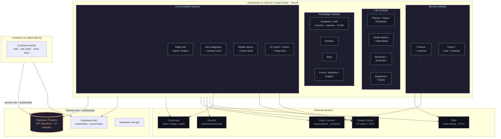
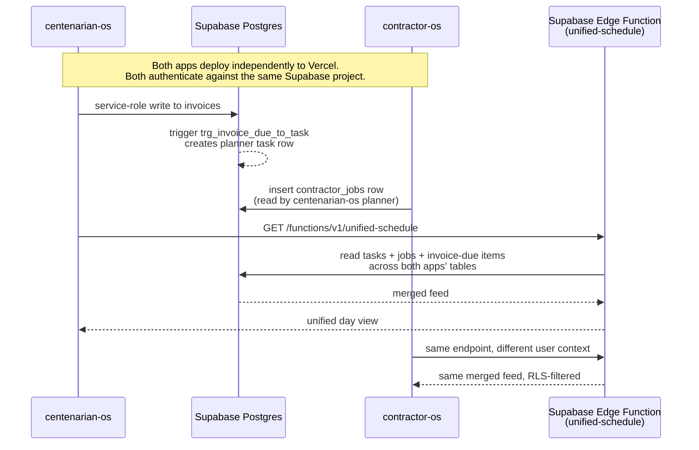

# CentenarianOS — Architecture

> A solo-built personal operating system. Next.js 14 App Router on Vercel, Supabase Postgres + Auth, **shared database with a sibling product** ([Work.WitUS / contractor-os](https://github.com/dapperAuteur/contractor-os)), offline-first via service-worker + IndexedDB queue, AI coach via Gemini, OCR via Gemini Vision, payments via Stripe Connect, transactional email via Resend.

## The 14-module layout



## The shared-database boundary

The most architecturally interesting part of the system: **one Supabase Postgres instance backs two distinct products.**

- **centenarian-os** — this repo. Personal OS for tracking life across 14 modules.
- **contractor-os** — sibling repo. Work portal for union/freelance contractors (jobs, rate cards, union document RAG).

Both apps speak to the same Postgres via the same Supabase client library. Some tables are app-private (`recipes`, `blog_posts`, `job_replacement_requests`); others are explicitly shared (`profiles`, `auth.users`, `tasks`, `invoices`, `contact_*`, `notification_preferences`).

Coordination rules — [`CLAUDE.md`](./CLAUDE.md) §"Shared Database" is the source of truth:

1. **Migrations are additive only.** `ADD COLUMN IF NOT EXISTS`, `CREATE TABLE IF NOT EXISTS`. No drops, no renames without cross-app review.
2. **RLS policies stay app-agnostic.** Don't write a policy that assumes a single app context.
3. **TypeScript types use optional chaining + defaults** when reading shared tables. `profile.clock_format` may not exist in the other app's type definitions even though the column does in the DB.
4. **The service-role key bypasses RLS** and is only used in API routes. Public surfaces use the publishable key + the user's auth session.

The result is a **monorepo discipline applied across two repos**: every schema change is a coordination event, even though the apps deploy independently.

### Cross-app traffic flow



The `unified-schedule` edge function is the canonical example of "this only works because the database is shared." Each app reads the merged feed; neither app needs to know about the other's HTTP API.

## Offline-first sync layer

A second architecturally distinctive piece: most data-fetching uses an offline-aware wrapper around `fetch()`.

- [`lib/offline/sync-manager.ts`](./lib/offline/sync-manager.ts) — singleton. URL-keyed IndexedDB cache (DB v3) + per-mutation queue.
- [`lib/offline/offline-fetch.ts`](./lib/offline/offline-fetch.ts) — drop-in replacement for `fetch()`. GETs cache + serve stale on offline. POST/PATCH/DELETE queue when offline, replay on reconnect.
- [`lib/contexts/SyncContext.tsx`](./lib/contexts/SyncContext.tsx) — global `isOffline / pending / failed / isSyncing / justSynced` state.
- [`components/ui/OfflineIndicator.tsx`](./components/ui/OfflineIndicator.tsx) — 5-state top bar.
- [`public/sw.js`](./public/sw.js) — service-worker v4. Stale-while-revalidate for `/api/*`, `offline.html` fallback for uncached pages.

Trade-off: this wrapper isn't applied uniformly. Pages that talk Supabase-direct (notably the planner) use a different pattern (`useOfflineSync` hook) that operates on cache keys instead of URLs. The two patterns coexist; consolidating them is on the long-term backlog.

## Stack

| Layer | Choice | Why |
|---|---|---|
| Framework | Next.js 14 App Router | Server Components by default, route handlers for the API surface. |
| Hosting | Vercel | Fluid Compute for the Node.js routes, native Next.js deployment, Marketplace integrations for Supabase + Resend. |
| Database | Supabase Postgres | Single-vendor managed Postgres + Auth + Storage + Edge Functions; RLS is the security model. Shared with contractor-os. |
| Auth | Supabase Auth via `@supabase/ssr` | Cookie-based session, browser + SSR access via the same package. Migrated to publishable + secret key system in plans 39 + 43. |
| Styling | Tailwind v4 | Utility-first; design tokens via Tailwind theme. WCAG 2.1 AA contrast enforced via global CSS overrides ([`app/globals.css`](./app/globals.css)). |
| Type system | TypeScript strict | No `any` escape hatches in app code. |
| Charts | Recharts | Admin dashboards + correlations module. |
| Media | Cloudinary | Audio / video / image / 360° via signed uploads. Audio served under Cloudinary's `video` resource type (their classification quirk). |
| Payments | Stripe Connect Express | Teacher payouts (LMS) + platform subscriptions. Webhook-driven sync. |
| AI | Google Gemini | AI coach (`gemini-2.5-flash`), embeddings (`text-embedding-004` for CYOA navigation), Vision (universal OCR for receipts/recipes/fuel). |
| Email | Resend (via Supabase native integration) | Transactional auth email + admin notifications. |
| Bank linking | Teller | mTLS-authenticated personal-banking API. Cert + key stored as base64-encoded PEM in env vars. |
| Bot prevention | Cloudflare Turnstile | Signup gate. |
| Maps | Leaflet + OSRM | Interactive maps in academy lessons + travel route planning. |
| 360° / VR | Photo Sphere Viewer | 360 video + photo lessons + virtual tours with hotspots. |

## Repo layout

```
centenarian-os/
├── app/                   # Next.js App Router pages + API routes
│   ├── (public)/          # Marketing, signup, blog, recipes
│   ├── academy/           # Public LMS catalog + lesson player
│   ├── dashboard/         # 14 module dashboards (planner, finance, …)
│   └── api/               # Route handlers (200+ endpoints)
├── components/            # React components
│   ├── academy/           # LMS components (course-editor, tour-editor, media-library)
│   ├── finance/           # Invoice / category / transfer modals
│   ├── planner/           # Task / schedule / paycheck modals
│   ├── ui/                # Reusable primitives (Modal, PaginationBar, etc.)
│   └── …                  # One folder per module
├── lib/                   # Shared utilities
│   ├── supabase/          # client.ts (browser), server.ts (SSR cookies)
│   ├── offline/           # sync-manager, offline-fetch
│   ├── academy/           # Course / lesson / tour helpers
│   ├── csv/               # Import/export helpers
│   └── …
├── supabase/
│   ├── migrations/        # 187 sequential SQL files (see MIGRATIONS.md)
│   └── functions/         # Edge functions (unified-schedule lives in contractor-os)
├── public/
│   ├── sw.js              # Service worker
│   ├── templates/         # CSV import templates per module
│   └── blog/              # Blog post images
├── plans/                 # Local-only (gitignored) — implementation plans + user-task queue
├── content/               # Local-only (gitignored) — tutorial scripts
├── ARCHITECTURE.md        # this file
├── MIGRATIONS.md          # the migrations gallery
├── CLAUDE.md              # AI-collaborator instructions + style + shared-DB rule
├── STYLE_GUIDE.md         # git workflow + branch naming + commit conventions
└── README.md              # top-level intro
```

## Where to dig deeper

- **Migrations** → [`MIGRATIONS.md`](./MIGRATIONS.md) for the full breakdown, or [`supabase/migrations/`](./supabase/migrations/) for the source.
- **Shared-DB rule** → [`CLAUDE.md`](./CLAUDE.md) §"Shared Database".
- **Branch + commit + PR workflow** → [`STYLE_GUIDE.md`](./STYLE_GUIDE.md).
- **Style + a11y conventions** → [`CLAUDE.md`](./CLAUDE.md) §"Theme & Colors", §"Mobile-First & Touch Targets", §"ARIA & Accessibility".
- **Offline sync** → [`lib/offline/`](./lib/offline/) and [`public/sw.js`](./public/sw.js).
- **Auth helpers** → [`lib/supabase/client.ts`](./lib/supabase/client.ts) (browser) and [`lib/supabase/server.ts`](./lib/supabase/server.ts) (SSR).
