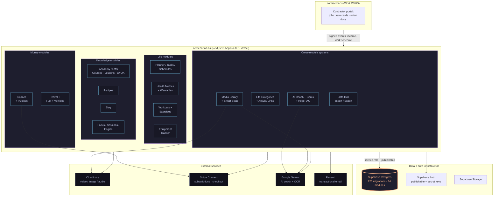

# CentenarianOS — Architecture

> **One job: the longevity correlation engine over your personal data.** The breadth below exists
> so health, habits, focus, nutrition and personal finance can share one datastore — that
> co-location is what `/dashboard/correlations`, `/dashboard/retrospective` and
> `/dashboard/weekly-review` are built on. Modules a sibling WitUS app already owns are being
> carved out (see the decomposition plan in the untracked `plans/` area); the correlation core
> stays integrated on purpose.

> A solo-built personal operating system. Next.js 15 App Router on Vercel, Supabase Postgres + Auth, its own database (shared with the sibling product [Work.WitUS / contractor-os](https://github.com/dapperAuteur/contractor-os) until 2026-10), offline-first via service-worker + IndexedDB queue, AI coach via Gemini, OCR via Gemini Vision, payments via Stripe Connect, transactional email via Resend.

## The 14-module layout


```mermaid
flowchart TB
  classDef shell fill:#1e1e2e,stroke:#cba6f7,color:#cdd6f4
  classDef module fill:#181825,stroke:#74c7ec,color:#cdd6f4
  classDef shared fill:#1e1e2e,stroke:#fab387,color:#fab387,stroke-width:3px
  classDef external fill:#11111b,stroke:#a6adc8,color:#a6adc8

  subgraph CentOS["centenarian-os (Next.js 15 App Router · Vercel)"]
    direction TB

    subgraph Life["Life modules"]
      direction LR
      Planner[Planner / Tasks /<br/>Schedules]
      Health[Health Metrics<br/>+ Wearables]
      Workouts[Workouts +<br/>Exercises]
      Equipment[Equipment<br/>Tracker]
    end

    subgraph Money["Money modules"]
      direction LR
      Finance[Finance<br/>+ Invoices]
      Travel[Travel +<br/>Fuel + Vehicles]
    end

    subgraph Knowledge["Knowledge modules"]
      direction LR
      Academy[Academy / LMS<br/>Courses · Lessons · CYOA]
      Recipes[Recipes]
      Blog[Blog]
      Focus[Focus / Sessions /<br/>Engine]
    end

    subgraph Cross["Cross-module systems"]
      direction LR
      DataHub[Data Hub<br/>Import / Export]
      Categories[Life Categories<br/>+ Activity Links]
      MediaLib[Media Library<br/>+ Smart Scan]
      Coach[AI Coach + Gems<br/>+ Help RAG]
    end
  end

  subgraph Shared["Data + auth infrastructure"]
    direction TB
    Supabase[(Supabase Postgres<br/>220 migrations · 14 modules)]:::shared
    SupaAuth[Supabase Auth<br/>publishable + secret keys]
    SupaStorage[Supabase Storage]
  end

  subgraph Sibling["contractor-os (Work.WitUS)"]
    Contractor[Contractor portal:<br/>jobs · rate cards · union docs]
  end

  subgraph External["External services"]
    Cloudinary[Cloudinary<br/>video / image / audio]
    Stripe[Stripe Connect<br/>subscriptions · checkout]
    Gemini[Google Gemini<br/>AI coach + OCR]
    Resend[Resend<br/>transactional email]
  end

  CentOS -->|service-role + publishable| Supabase
  Sibling -->|signed events: income, work schedule| CentOS
  CentOS --> SupaAuth
  CentOS --> Cloudinary
  CentOS --> Stripe
  CentOS --> Gemini
  CentOS --> Resend
  Coach --> Gemini
  MediaLib --> Cloudinary
  MediaLib --> Gemini
  Finance --> Stripe

  class Life,Money,Knowledge,Cross shell
  class Planner,Health,Workouts,Equipment,Finance,Travel,Academy,Recipes,Blog,Focus,DataHub,Categories,MediaLib,Coach module
  class Cloudinary,Stripe,Gemini,Resend external
```

## The database boundary (formerly shared)

**CentenarianOS has its own database.** Until 2026-10, one Supabase Postgres instance backed two products — this repo and **contractor-os** (Work.WitUS, a work portal for union/freelance contractors). In 2026-10 Work.WitUS moved to its own database; the two apps no longer read or write the same tables.

### Now: events and APIs only

Cross-app data flows only through signed events and APIs:

- **Work.WitUS → CentOS:** HMAC-signed income events ([`app/api/events/income`](./app/api/events/income/route.ts)) and work-schedule events ([`app/api/events/work-schedule`](./app/api/events/work-schedule/route.ts)) feed the finance forecast and the planner.
- **RideWitUS:** read-only feeds and the calendar activity feed (see the README's RideWitUS section).

Neither app reaches into the other's database. Rules — [`CLAUDE.md`](./CLAUDE.md) §"Database" is the source of truth:

1. **Migrations stay additive and idempotent.** `ADD COLUMN IF NOT EXISTS`, `CREATE TABLE IF NOT EXISTS`, guarded policies. Kept as the house rule for production data and rollback safety.
2. **The service-role key bypasses RLS** and is only used in API routes. Public surfaces use the publishable key + the user's auth session.
3. **`profiles` is owner-only; other users go through `public_profiles`.** Billing, plan and role columns are written only with the service role (a trigger rejects browser-session writes, migration 206). Pages that show another user's name, avatar or bio read the `public_profiles` view; the table itself returns only the caller's own row (migration 207).

### History: the shared-database era (until 2026-10)

Both apps spoke to the same Postgres via the same Supabase client library. Some tables were app-private (`recipes`, `blog_posts`, `job_replacement_requests`); others were shared (`profiles`, `auth.users`, `tasks`, `invoices`, `contact_*`, `notification_preferences`). Every schema change was a coordination event, which is why migrations before 2026-10 are additive-only, RLS policies were kept app-agnostic, and many files still carry "SHARED DB" comments.

Cross-app traffic then ran through the database itself — a trigger (`trg_invoice_due_to_task`) materialized planner tasks from invoices, and a `unified-schedule` Supabase Edge Function merged tasks, jobs and invoice-due items across both apps' tables. The cross-app triggers were dropped before the split and replaced by the signed events above.

## Offline-first sync layer

A second architecturally distinctive piece: most data-fetching uses an offline-aware wrapper around `fetch()`.

- [`lib/offline/sync-manager.ts`](./lib/offline/sync-manager.ts) — singleton. URL-keyed IndexedDB cache (DB v3) + per-mutation queue.
- [`lib/offline/offline-fetch.ts`](./lib/offline/offline-fetch.ts) — drop-in replacement for `fetch()`. GETs cache + serve stale on offline. POST/PATCH/DELETE queue when offline, replay on reconnect.
- [`lib/contexts/SyncContext.tsx`](./lib/contexts/SyncContext.tsx) — global `isOffline / pending / failed / isSyncing / justSynced` state.
- [`components/ui/OfflineIndicator.tsx`](./components/ui/OfflineIndicator.tsx) — 5-state top bar.
- [`public/sw.js`](./public/sw.js) — service-worker v4. Stale-while-revalidate for `/api/*`, `offline.html` fallback for uncached pages.

Trade-off: this wrapper isn't applied uniformly. Pages that talk Supabase-direct (notably the planner) use a different pattern (`useOfflineSync` hook) that operates on cache keys instead of URLs. The two patterns coexist; consolidating them is on the long-term backlog.

## Stack

| Layer | Choice | Why |
|---|---|---|
| Framework | Next.js 15 App Router | Server Components by default, route handlers for the API surface. |
| Hosting | Vercel | Fluid Compute for the Node.js routes, native Next.js deployment, Marketplace integrations for Supabase + Resend. |
| Database | Supabase Postgres | Single-vendor managed Postgres + Auth + Storage + Edge Functions; RLS is the security model. CentOS's own database (shared with contractor-os until 2026-10). |
| Auth | Supabase Auth via `@supabase/ssr` | Cookie-based session, browser + SSR access via the same package. Migrated to publishable + secret key system in plans 39 + 43. |
| Styling | Tailwind v4 | Utility-first; design tokens via Tailwind theme. WCAG 2.1 AA contrast enforced via global CSS overrides ([`app/globals.css`](./app/globals.css)). |
| Type system | TypeScript strict | No `any` escape hatches in app code. |
| Charts | Recharts | Admin dashboards + correlations module. |
| Media | Cloudinary | Audio / video / image / 360° via signed uploads. Audio served under Cloudinary's `video` resource type (their classification quirk). |
| Payments | Stripe Connect Express | Teacher payouts (LMS) + platform subscriptions. Webhook-driven sync. |
| AI | Google Gemini | AI coach (`gemini-2.5-flash`), embeddings (`text-embedding-004` for CYOA navigation), Vision (universal OCR for receipts/recipes/fuel). |
| Email | Resend (via Supabase native integration) | Transactional auth email + admin notifications. |
| Bot prevention | Cloudflare Turnstile | Signup gate. |
| Maps | Leaflet + OSRM | Interactive maps in academy lessons + travel route planning. |
| 360° / VR | Photo Sphere Viewer | 360 video + photo lessons + virtual tours with hotspots. |

## Repo layout

```
centenarian-os/
├── app/                   # Next.js App Router pages + API routes
│   ├── (public)/          # Marketing, signup, blog, recipes
│   ├── academy/           # Public LMS catalog + lesson player
│   ├── dashboard/         # 14 module dashboards (planner, finance, …)
│   └── api/               # Route handlers (200+ endpoints)
├── components/            # React components
│   ├── academy/           # LMS components (course-editor, tour-editor, media-library)
│   ├── finance/           # Invoice / category / transfer modals
│   ├── planner/           # Task / schedule / paycheck modals
│   ├── ui/                # Reusable primitives (Modal, PaginationBar, etc.)
│   └── …                  # One folder per module
├── lib/                   # Shared utilities
│   ├── supabase/          # client.ts (browser), server.ts (SSR cookies)
│   ├── offline/           # sync-manager, offline-fetch
│   ├── academy/           # Course / lesson / tour helpers
│   ├── csv/               # Import/export helpers
│   └── …
├── supabase/
│   ├── migrations/        # 215 SQL files (see MIGRATIONS.md)
│   └── functions/         # Edge functions (unified-schedule lived in contractor-os during the shared-DB era)
├── public/
│   ├── sw.js              # Service worker
│   ├── templates/         # CSV import templates per module
│   └── blog/              # Blog post images
├── plans/                 # Local-only (gitignored) — implementation plans + user-task queue
├── content/               # Local-only (gitignored) — tutorial scripts
├── ARCHITECTURE.md        # this file
├── MIGRATIONS.md          # the migrations gallery
├── CLAUDE.md              # AI-collaborator instructions + style + Database rule
├── STYLE_GUIDE.md         # git workflow + branch naming + commit conventions
└── README.md              # top-level intro
```

## Where to dig deeper

- **Migrations** → [`MIGRATIONS.md`](./MIGRATIONS.md) for the full breakdown, or [`supabase/migrations/`](./supabase/migrations/) for the source.
- **Database rule** → [`CLAUDE.md`](./CLAUDE.md) §"Database".
- **Branch + commit + PR workflow** → [`STYLE_GUIDE.md`](./STYLE_GUIDE.md).
- **Style + a11y conventions** → [`CLAUDE.md`](./CLAUDE.md) §"Theme & Colors", §"Mobile-First & Touch Targets", §"ARIA & Accessibility".
- **Offline sync** → [`lib/offline/`](./lib/offline/) and [`public/sw.js`](./public/sw.js).
- **Auth helpers** → [`lib/supabase/client.ts`](./lib/supabase/client.ts) (browser) and [`lib/supabase/server.ts`](./lib/supabase/server.ts) (SSR).
