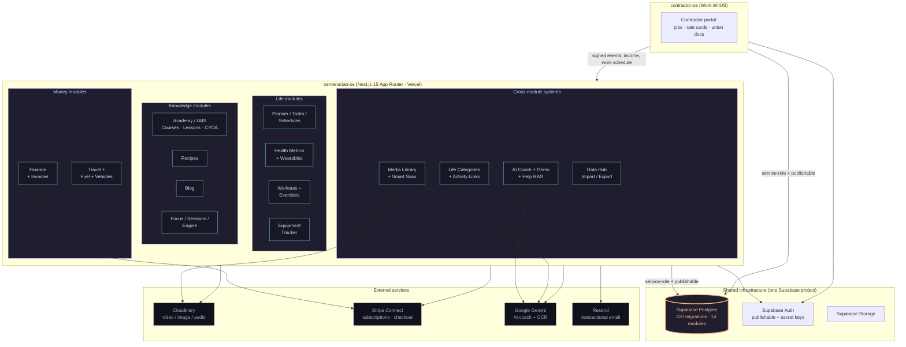

# CentenarianOS — Architecture

> **One job: the longevity correlation engine over your personal data.** The breadth below exists
> so health, habits, focus, nutrition and personal finance can share one datastore — that
> co-location is what `/dashboard/correlations`, `/dashboard/retrospective` and
> `/dashboard/weekly-review` are built on. Modules a sibling WitUS app already owns are being
> carved out (see the decomposition plan in the untracked `plans/` area); the correlation core
> stays integrated on purpose.

> A solo-built personal operating system. Next.js 15 App Router on Vercel, Supabase Postgres + Auth, **one database shared with a sibling product** ([Work.WitUS / contractor-os](https://github.com/dapperAuteur/contractor-os); a split is planned, not done), offline-first via service-worker + IndexedDB queue, AI coach via Gemini, OCR via Gemini Vision, payments via Stripe Connect, transactional email via Resend.

## The 14-module layout


```mermaid
flowchart TB
  classDef shell fill:#1e1e2e,stroke:#cba6f7,color:#cdd6f4
  classDef module fill:#181825,stroke:#74c7ec,color:#cdd6f4
  classDef shared fill:#1e1e2e,stroke:#fab387,color:#fab387,stroke-width:3px
  classDef external fill:#11111b,stroke:#a6adc8,color:#a6adc8

  subgraph CentOS["centenarian-os (Next.js 15 App Router · Vercel)"]
    direction TB

    subgraph Life["Life modules"]
      direction LR
      Planner[Planner / Tasks /<br/>Schedules]
      Health[Health Metrics<br/>+ Wearables]
      Workouts[Workouts +<br/>Exercises]
      Equipment[Equipment<br/>Tracker]
    end

    subgraph Money["Money modules"]
      direction LR
      Finance[Finance<br/>+ Invoices]
      Travel[Travel +<br/>Fuel + Vehicles]
    end

    subgraph Knowledge["Knowledge modules"]
      direction LR
      Academy[Academy / LMS<br/>Courses · Lessons · CYOA]
      Recipes[Recipes]
      Blog[Blog]
      Focus[Focus / Sessions /<br/>Engine]
    end

    subgraph Cross["Cross-module systems"]
      direction LR
      DataHub[Data Hub<br/>Import / Export]
      Categories[Life Categories<br/>+ Activity Links]
      MediaLib[Media Library<br/>+ Smart Scan]
      Coach[AI Coach + Gems<br/>+ Help RAG]
    end
  end

  subgraph Shared["Shared infrastructure (one Supabase project)"]
    direction TB
    Supabase[(Supabase Postgres<br/>220 migrations · 14 modules)]:::shared
    SupaAuth[Supabase Auth<br/>publishable + secret keys]
    SupaStorage[Supabase Storage]
  end

  subgraph Sibling["contractor-os (Work.WitUS)"]
    Contractor[Contractor portal:<br/>jobs · rate cards · union docs]
  end

  subgraph External["External services"]
    Cloudinary[Cloudinary<br/>video / image / audio]
    Stripe[Stripe Connect<br/>subscriptions · checkout]
    Gemini[Google Gemini<br/>AI coach + OCR]
    Resend[Resend<br/>transactional email]
  end

  CentOS -->|service-role + publishable| Supabase
  Sibling -->|service-role + publishable| Supabase
  Sibling -->|signed events: income, work schedule| CentOS
  CentOS --> SupaAuth
  Sibling --> SupaAuth
  CentOS --> Cloudinary
  CentOS --> Stripe
  CentOS --> Gemini
  CentOS --> Resend
  Coach --> Gemini
  MediaLib --> Cloudinary
  MediaLib --> Gemini
  Finance --> Stripe

  class Life,Money,Knowledge,Cross shell
  class Planner,Health,Workouts,Equipment,Finance,Travel,Academy,Recipes,Blog,Focus,DataHub,Categories,MediaLib,Coach module
  class Cloudinary,Stripe,Gemini,Resend external
```

## The shared-database boundary

The most architecturally interesting part of the system: **one Supabase project backs two distinct products.**

- **centenarian-os**: this repo. Personal OS for tracking life across 14 modules.
- **contractor-os**: sibling repo (Work.WitUS). Work portal for union/freelance contractors (jobs, rate cards, union document RAG).

Both apps speak to the same Postgres via the same Supabase client library, and both sign users in through the same Supabase Auth. Some tables are app-private (`recipes`, `blog_posts`, `job_replacement_requests`); others are used by both (`profiles`, `auth.users`, `tasks`, `invoices`, `contact_*`, `notification_preferences`). Supabase Auth settings (email templates, SMTP sender, MFA) are set per project, so changing them for one app changes them for both.

Coordination rules: [`CLAUDE.md`](./CLAUDE.md) §"Database" is the source of truth.

1. **Migrations are additive and idempotent.** `ADD COLUMN IF NOT EXISTS`, `CREATE TABLE IF NOT EXISTS`, guarded policies. No drops, no renames, and no RLS tightening on shared tables without checking contractor-os.
2. **RLS policies stay app-agnostic.** Don't write a policy that assumes a single app context.
3. **TypeScript types use optional chaining + defaults** when reading shared tables. `profile.clock_format` may not exist in the other app's type definitions even though the column does in the DB.
4. **The service-role key bypasses RLS** and is only used in API routes. Public surfaces use the publishable key + the user's auth session.
5. **`profiles` is owner-only; other users go through `public_profiles`.** Billing, plan and role columns are written only with the service role (a trigger rejects browser-session writes, migration 206). Pages that show another user's name, avatar or bio read the `public_profiles` view; the table itself returns only the caller's own row (migration 207). Because the project is shared, these rules apply to Work.WitUS too.

Every schema change is a coordination event, even though the apps deploy independently. That is why the migrations are additive-only and many files carry "SHARED DB" comments.

### Cross-app traffic today

The apps are being decoupled ahead of a split, so cross-app data increasingly moves through signed events and APIs instead of shared tables:

- **Work.WitUS → CentOS:** HMAC-signed income events ([`app/api/events/income`](./app/api/events/income/route.ts)) and work-schedule events ([`app/api/events/work-schedule`](./app/api/events/work-schedule/route.ts)) fill CentOS's own projections (`income_events`, `work_schedule_events`), which feed the finance forecast and the planner. While a projection is empty, CentOS falls back to reading the contractor tables directly ([`lib/finance/income-source.ts`](./lib/finance/income-source.ts), [`lib/planner/work-schedule-source.ts`](./lib/planner/work-schedule-source.ts)).
- **Planner tasks from invoices and pay dates:** the database triggers that used to write these across the app boundary (`trg_invoice_due_to_task`, `trg_pay_date_to_task`) were dropped in migration 198 (2026-09). [`lib/planner/sync-tasks.ts`](./lib/planner/sync-tasks.ts) now creates the tasks from the signed income events.
- **Still direct:** contractor-os's `unified-schedule` Supabase Edge Function reads `tasks`, `contractor_jobs`, `invoices` and `expected_payments` from the shared tables, and Work.WitUS reads shared tables such as `profiles` throughout.
- **RideWitUS:** a separate app; it talks to CentOS only through signed requests: read-only feeds and the calendar activity feed (see the README's RideWitUS section).

### The planned split (not done)

The plan is for Work.WitUS to move to its own database (Neon; CentOS plan 55, Phase 3, in the untracked `plans/` area). That move has not happened: Work.WitUS still runs entirely on Supabase against this same project, and neither app's runtime code connects to the planned database (only the Phase 3 tooling in [`supabase/neon/`](./supabase/neon/) and `scripts/phase3-*` is written for it). Until the split lands and is confirmed, treat the database as shared and follow the rules above.

## Offline-first sync layer

A second architecturally distinctive piece: most data-fetching uses an offline-aware wrapper around `fetch()`.

- [`lib/offline/sync-manager.ts`](./lib/offline/sync-manager.ts) — singleton. URL-keyed IndexedDB cache (DB v3) + per-mutation queue.
- [`lib/offline/offline-fetch.ts`](./lib/offline/offline-fetch.ts) — drop-in replacement for `fetch()`. GETs cache + serve stale on offline. POST/PATCH/DELETE queue when offline, replay on reconnect.
- [`lib/contexts/SyncContext.tsx`](./lib/contexts/SyncContext.tsx) — global `isOffline / pending / failed / isSyncing / justSynced` state.
- [`components/ui/OfflineIndicator.tsx`](./components/ui/OfflineIndicator.tsx) — 5-state top bar.
- [`public/sw.js`](./public/sw.js) — service-worker v4. Stale-while-revalidate for `/api/*`, `offline.html` fallback for uncached pages.

Trade-off: this wrapper isn't applied uniformly. Pages that talk Supabase-direct (notably the planner) use a different pattern (`useOfflineSync` hook) that operates on cache keys instead of URLs. The two patterns coexist; consolidating them is on the long-term backlog.

## Stack

| Layer | Choice | Why |
|---|---|---|
| Framework | Next.js 15 App Router | Server Components by default, route handlers for the API surface. |
| Hosting | Vercel | Fluid Compute for the Node.js routes, native Next.js deployment, Marketplace integrations for Supabase + Resend. |
| Database | Supabase Postgres | Single-vendor managed Postgres + Auth + Storage + Edge Functions; RLS is the security model. Shared with contractor-os (Work.WitUS); a split is planned, not done. |
| Auth | Supabase Auth via `@supabase/ssr` | Cookie-based session, browser + SSR access via the same package. Migrated to publishable + secret key system in plans 39 + 43. |
| Styling | Tailwind v4 | Utility-first; design tokens via Tailwind theme. WCAG 2.1 AA contrast enforced via global CSS overrides ([`app/globals.css`](./app/globals.css)). |
| Type system | TypeScript strict | No `any` escape hatches in app code. |
| Charts | Recharts | Admin dashboards + correlations module. |
| Media | Cloudinary | Audio / video / image / 360° via signed uploads. Audio served under Cloudinary's `video` resource type (their classification quirk). |
| Payments | Stripe Connect Express | Teacher payouts (LMS) + platform subscriptions. Webhook-driven sync. |
| AI | Google Gemini | AI coach (`gemini-2.5-flash`), embeddings (`text-embedding-004` for CYOA navigation), Vision (universal OCR for receipts/recipes/fuel). |
| Email | Resend (via Supabase native integration) | Transactional auth email + admin notifications. |
| Bot prevention | Cloudflare Turnstile | Signup gate. |
| Maps | Leaflet + OSRM | Interactive maps in academy lessons + travel route planning. |
| 360° / VR | Photo Sphere Viewer | 360 video + photo lessons + virtual tours with hotspots. |

## Repo layout

```
centenarian-os/
├── app/                   # Next.js App Router pages + API routes
│   ├── (public)/          # Marketing, signup, blog, recipes
│   ├── academy/           # Public LMS catalog + lesson player
│   ├── dashboard/         # 14 module dashboards (planner, finance, …)
│   └── api/               # Route handlers (200+ endpoints)
├── components/            # React components
│   ├── academy/           # LMS components (course-editor, tour-editor, media-library)
│   ├── finance/           # Invoice / category / transfer modals
│   ├── planner/           # Task / schedule / paycheck modals
│   ├── ui/                # Reusable primitives (Modal, PaginationBar, etc.)
│   └── …                  # One folder per module
├── lib/                   # Shared utilities
│   ├── supabase/          # client.ts (browser), server.ts (SSR cookies)
│   ├── offline/           # sync-manager, offline-fetch
│   ├── academy/           # Course / lesson / tour helpers
│   ├── csv/               # Import/export helpers
│   └── …
├── supabase/
│   ├── migrations/        # 215 SQL files (see MIGRATIONS.md)
│   └── functions/         # Edge functions (unified-schedule lives in contractor-os)
├── public/
│   ├── sw.js              # Service worker
│   ├── templates/         # CSV import templates per module
│   └── blog/              # Blog post images
├── plans/                 # Local-only (gitignored) — implementation plans + user-task queue
├── content/               # Local-only (gitignored) — tutorial scripts
├── ARCHITECTURE.md        # this file
├── MIGRATIONS.md          # the migrations gallery
├── CLAUDE.md              # AI-collaborator instructions + style + shared-DB rule
├── STYLE_GUIDE.md         # git workflow + branch naming + commit conventions
└── README.md              # top-level intro
```

## Where to dig deeper

- **Migrations** → [`MIGRATIONS.md`](./MIGRATIONS.md) for the full breakdown, or [`supabase/migrations/`](./supabase/migrations/) for the source.
- **Shared-DB rule** → [`CLAUDE.md`](./CLAUDE.md) §"Database".
- **Branch + commit + PR workflow** → [`STYLE_GUIDE.md`](./STYLE_GUIDE.md).
- **Style + a11y conventions** → [`CLAUDE.md`](./CLAUDE.md) §"Theme & Colors", §"Mobile-First & Touch Targets", §"ARIA & Accessibility".
- **Offline sync** → [`lib/offline/`](./lib/offline/) and [`public/sw.js`](./public/sw.js).
- **Auth helpers** → [`lib/supabase/client.ts`](./lib/supabase/client.ts) (browser) and [`lib/supabase/server.ts`](./lib/supabase/server.ts) (SSR).
