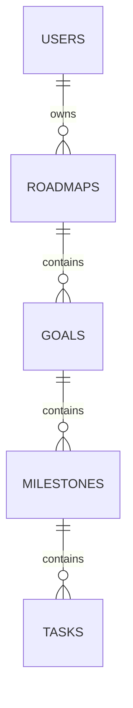

# Centenarian OS

A modular productivity platform for executing multi-decade, multi-disciplinary goals through data-driven daily action.

## 🎯 Vision

The Centenarian OS connects long-term ambitions to daily execution through an integrated system that tracks planning, nutrition, focus sessions, and recovery—all while functioning offline-first.

## 🏗️ Architecture

**Modular Monolith** built with:
- **Frontend**: Next.js 14+ (App Router), TypeScript, Tailwind CSS
- **Backend**: Supabase (PostgreSQL + Real-time subscriptions)
- **Offline**: IndexedDB with sync queue
- **State**: React hooks + Supabase real-time

### Core Modules (Phase 1)

1. **Planner** - Hierarchical goal tracking (Roadmap → Goals → Milestones → Tasks)
2. **Fuel** - Nutrition logging with NCV framework
3. **Engine** - Focus tracking + daily debrief system

## 🚀 Quick Start

### Prerequisites

- Node.js 18+
- npm/yarn/pnpm
- Supabase account ([supabase.com](https://supabase.com))

### Installation

```bash
# Clone repo
git clone https://github.com/dapperAuteur/centenarian-os.git
cd centenarian-os

# Install dependencies
npm install

# Setup environment
cp .env.example .env.local
# Edit .env.local with your Supabase credentials
```

### Database Setup

1. Create a new Supabase project
2. Run migrations:
   ```bash
   # Option A: Supabase CLI
   supabase db push

   # Option B: SQL Editor in Supabase Dashboard
   # Paste contents of supabase/migrations/*.sql
   ```

### Run Development Server

```bash
npm run dev
```

Open [http://localhost:3000](http://localhost:3000)

## 📁 Project Structure

```
centenarian-os/
├── app/                    # Next.js App Router pages
│   ├── (auth)/            # Authentication routes
│   ├── dashboard/         # Main application
│   └── layout.tsx         # Root layout
├── components/            # React components
│   ├── planner/          # Planner module UI
│   ├── fuel/             # Nutrition module UI
│   └── shared/           # Reusable components
├── lib/
│   ├── hooks/            # Custom React hooks
│   ├── offline/          # Offline sync logic
│   ├── supabase/         # Database clients
│   └── types/            # TypeScript definitions
└── supabase/
    └── migrations/       # Database schema
```

## 🔒 Security

- **Authentication**: Supabase Auth (email/password + optional OAuth)
- **Authorization**: Row Level Security (RLS) policies
- **Data Encryption**: TLS 1.3 in transit, AES-256 at rest (Supabase managed)
- **Input Validation**: Zod schemas + Supabase type enforcement
- **Security Headers**: CSP, HSTS, X-Frame-Options via middleware

Report vulnerabilities to [security@awews.com](mailto:security@awews.com)

## 🧪 Testing

```bash
# Run unit tests
npm test

# Run E2E tests
npm run test:e2e

# Type checking
npm run type-check

# Linting
npm run lint
```

## 📊 Data Model



See [Database Schema](./supabase/migrations/001_planner_module.sql) for details.

## 🛣️ Roadmap

- [x] Phase 1: Core planner module with offline support
- [ ] Phase 2: Nutrition tracking (Fuel module)
- [ ] Phase 3: Focus tracking + AI-assisted debrief
- [ ] Phase 4: Biometrics integration
- [ ] Phase 5: Financial dashboard

## 🤝 Contributing

See [CONTRIBUTING.md](./CONTRIBUTING.md) for development workflow and coding standards.

## 📄 License

MIT License - see [LICENSE](./LICENSE)

## 🙏 Acknowledgments

Built with:
- [Next.js](https://nextjs.org/)
- [Supabase](https://supabase.com/)
- [Tailwind CSS](https://tailwindcss.com/)
- [TypeScript](https://www.typescriptlang.org/)

---

**Status**: Active Development | **Version**: 0.1.0-alpha