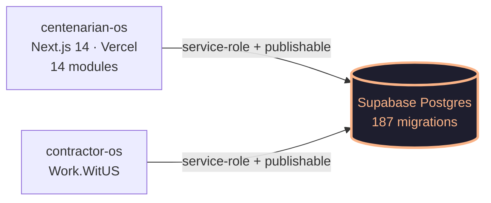

# CentenarianOS

> **Solo-built personal OS.** 14 modules in one Next.js 14 monolith, **Supabase Postgres shared with a sibling product** ([Work.WitUS](https://work.witus.online)), offline-first via service-worker + IndexedDB queue, **187 migrations** to date.


```mermaid
flowchart LR
  classDef shared fill:#1e1e2e,stroke:#fab387,color:#fab387,stroke-width:3px
  classDef external fill:#11111b,stroke:#a6adc8,color:#a6adc8

  CentOS[centenarian-os<br/>Next.js 14 · Vercel<br/>14 modules]
  Contractor[contractor-os<br/>Work.WitUS]
  DB[(Supabase Postgres<br/>187 migrations)]:::shared

  CentOS -->|service-role + publishable| DB
  Contractor -->|service-role + publishable| DB
```

For dev-audience readers:

- **[ARCHITECTURE.md](./ARCHITECTURE.md)** — full module map, Mermaid diagrams of the shared-DB boundary, cross-app traffic via the `unified-schedule` edge function, offline-sync layer, repo layout, and stack table.
- **[MIGRATIONS.md](./MIGRATIONS.md)** — 187 migrations grouped by module, the additive-only discipline that makes shared-DB sane, notable patterns (polymorphic `activity_links`, hot-fix pairs, intentional number collisions), and how to reproduce the count.
- **[CLAUDE.md](./CLAUDE.md)** — AI-collaborator instructions doubling as the project conventions doc (style, a11y, the Shared Database rule, branch workflow).
- **[STYLE_GUIDE.md](./STYLE_GUIDE.md)** — git workflow, branch naming, Conventional Commits, PR rules. Every change starts on a new branch off `main`; `main` is never pushed to directly.
- **[docs/CentenarianAcademy/](./docs/CentenarianAcademy/)** — course-authoring standards: `CourseAuthoringGuide.md` (craft), `CourseProductionPlaybook.md` (process), `CitationIntegrityGuide.md` (verify every source, never ship a fake citation), and `CourseCreationWithAI.md` (hand to your AI). Courses cite only verified, peer-reviewed sources and ship a teacher evidence ledger.

What makes the architecture interesting (and the marketing pitch hard):

1. **Shared database, two apps.** Both this repo and contractor-os hit the same Supabase project. Migrations are additive-only across the boundary; some columns + triggers exist purely so one app can react to writes from the other (e.g., `trg_invoice_due_to_task` materializes a planner row from a contractor invoice).
2. **14 product modules.** Planner · Finance · Focus · Health Metrics · Wearables · Workouts · Exercises · Equipment · Travel · Fuel · Recipes · Blog · Academy/LMS · AI Coach. Plus auxiliary cross-cutting systems (Data Hub, Life Categories, Activity Links, Media Library, Smart Scan).
3. **Offline-first with a real sync queue.** [`lib/offline/sync-manager.ts`](./lib/offline/sync-manager.ts) wraps `fetch()` with a URL-keyed IndexedDB cache for GETs and a queued mutation log for POST/PATCH/DELETE that replays on reconnect. 5-state UI indicator. Service worker stale-while-revalidate.
4. **Multi-decade horizon.** The schema breadth is justified by the use case: a personal OS that wants to be useful for 50+ years has to model planning, money, body, learning, attention, and everything that links them, rather than picking one vertical.

## Operating context

Operated by B4C LLC / AwesomeWebStore.com. Built solo by [Brand Anthony McDonald](https://brandanthonymcdonald.com).

```
B4C LLC / AwesomeWebStore.com  ← legal entity
└── WitUS.online               ← parent brand (philosophy + product directory)
    ├── CentenarianOS.com      ← this repo — multi-decade personal OS
    │   └── Academy (LMS)      ← module inside CentenarianOS, hosts BVC curriculum
    └── Work.WitUS.Online      ← separate app, contractor operations (shares DB)
```

The Academy is a module of CentenarianOS — not a separate product. There is no standalone "Learn.WitUS" app.

## Stack

| Layer | Choice | Notes |
|---|---|---|
| Framework | Next.js 14 App Router | Server Components by default, route handlers for the API surface (200+ endpoints). |
| Hosting | Vercel | Fluid Compute for Node.js routes. |
| Database | Supabase Postgres | RLS as the security model. **Shared with contractor-os.** |
| Auth | `@supabase/ssr` | Cookie-based; browser + SSR via the same client. New publishable + secret key system. |
| Styling | Tailwind v4 | WCAG 2.1 AA contrast enforced via global CSS overrides ([`app/globals.css`](./app/globals.css)). |
| Type system | TypeScript strict | No `any` escape hatches in app code. |
| Charts | Recharts | Admin dashboards + correlations module. |
| Media | Cloudinary | Audio / video / image / 360° via signed uploads. |
| Payments | Stripe Connect Express | Teacher payouts (LMS) + platform subscriptions. Webhook-driven sync. + CashApp (lifetime only). |
| AI | Google Gemini | Coach (`gemini-2.5-flash`), embeddings (`text-embedding-004` for CYOA navigation), Vision (universal OCR). |
| Email | Resend (via Supabase native integration) | Transactional auth + admin notifications. |
| Bank linking | Teller | mTLS-authenticated personal-banking API. |
| Bot prevention | Cloudflare Turnstile | Signup gate. |
| Maps | Leaflet + OSRM | Academy lessons + travel route planning. |
| 360° / VR | Photo Sphere Viewer | Lessons + virtual tours with hotspots. |

## Pricing

| Plan | Price | Notes |
|------|-------|-------|
| **Monthly** | $10.60/month | Full access, cancel anytime |
| **Lifetime (Founder's Price)** | $103.29 one-time | First 100 paid users. Includes free shirt. |
| **Lifetime via CashApp** | $100 to $centenarian | Fee-free alternative. Manual verification. |
| **Teacher Plan** | Separate pricing | 10% platform fee on course sales |

No free plan. All users must subscribe to access paid modules.

## Platform Modules

| Module | Description | Access |
|--------|-------------|--------|
| **Planner** | Roadmap, Goals, Milestones, Tasks hierarchy with week/3-day/daily views | Paid |
| **Fuel** | Nutrition tracking with NCV framework, USDA/Open Food Facts APIs, auto inventory | Paid |
| **Engine** | Pomodoro focus sessions, doodle canvas, daily debrief, AI weekly reviews | Paid |
| **Health Metrics** | RHR, steps, sleep, body composition; Garmin/Oura/WHOOP sync; CSV import | Paid |
| **Workouts & Exercises** | Exercise library with categories; workout templates; Nomad Longevity OS | Paid |
| **Financial Dashboard** | Accounts, transactions, budgets, invoices, bank linking via Teller | Paid |
| **Travel & Vehicles** | Fuel logs with OCR, trip tracking, multi-stop routes, maintenance, IRS mileage | Paid |
| **Equipment & Assets** | Asset tracking, valuation history, media gallery, cross-module links | Paid |
| **Correlations & Analytics** | Cross-module data correlations, trend charts, daily/weekly aggregates | Paid |
| **Data Hub** | CSV import/export for 12+ modules with Google Sheets templates | Paid |
| **Life Categories** | Tag activities across all modules with custom life-area categories | Paid |
| **Media Tracker** | Books, TV, movies, podcasts with notes and episode linking | Paid |
| **Academy (LMS)** | Create/sell courses; CYOA navigation; quizzes, maps, docs, audio, video | Free |
| **Blog** | Rich text publishing, likes/saves, public author profiles | Free |
| **Recipes** | Recipe sharing, URL import, cook profiles, JSON-LD scraping | Free |
| **Cross-Module Links** | Bidirectional activity links, saved contacts/locations across all modules | Paid |
| **AI Coach (Gems)** | Custom AI personas with document/flashcard support | Admin |

## Admin Dashboard

- **User management**: subscription filters, invite system with module restrictions
- **Promo campaigns**: create time-limited discounts with Stripe coupon integration
- **CashApp payments**: review queue for manual lifetime payment verification
- **Lifetime counter**: track paid vs gifted lifetime purchases (Founder's Price: first 100)
- **Content moderation**: recipes, blog posts, feedback, system logs
- **Academy settings**: teacher fee (10%), course management, assignment grading
- **Engagement metrics**: feature usage, conversion funnels, SEO, shortlinks
- **AI Education chat**: codebase Q&A with 5 modes (interview, investor, onboarding, demo, general)

## Quick Start

### Prerequisites

- Node.js 18+
- npm / yarn / pnpm
- Supabase account ([supabase.com](https://supabase.com))
- Stripe account (for subscription features)

### Installation

```bash
# Clone repo
git clone https://github.com/dapperAuteur/centenarian-os.git
cd centenarian-os

# Install dependencies
npm install

# Setup environment
cp .env.example .env.local
# Edit .env.local with your credentials
```

### Required Environment Variables

```env
NEXT_PUBLIC_SUPABASE_URL=
NEXT_PUBLIC_SUPABASE_ANON_KEY=
SUPABASE_SERVICE_ROLE_KEY=
STRIPE_SECRET_KEY=
STRIPE_WEBHOOK_SECRET=
NEXT_PUBLIC_STRIPE_PUBLISHABLE_KEY=
STRIPE_MONTHLY_PRICE_ID=
STRIPE_LIFETIME_PRICE_ID=
ADMIN_EMAIL=
NEXT_PUBLIC_ADMIN_EMAIL=
NEXT_PUBLIC_TURNSTILE_SITE_KEY=
TURNSTILE_SECRET_KEY=
GEMINI_API_KEY=
NEXT_PUBLIC_CLOUDINARY_CLOUD_NAME=
CLOUDINARY_API_KEY=
CLOUDINARY_API_SECRET=
NEXT_PUBLIC_CLOUDINARY_UPLOAD_PRESET=
```

### Database Setup

```bash
# Option A: Supabase CLI
supabase db push

# Option B: SQL Editor in Supabase Dashboard
# Run migrations in order from supabase/migrations/
```

There are 187 migrations (see [`MIGRATIONS.md`](./MIGRATIONS.md) for the gallery). Run them in numeric order. The database is shared with the ContractorOS (Work.WitUS) app — read [`CLAUDE.md`](./CLAUDE.md) §"Shared Database" before adding any.

### Run Development Server

```bash
npm run dev
```

Open [http://localhost:3000](http://localhost:3000)

## Project Structure

```
centenarian-os/
├── app/                        # Next.js App Router
│   ├── api/                   # API route handlers
│   │   ├── cashapp/           # CashApp payment submission
│   │   ├── exercises/         # Exercise library CRUD
│   │   ├── finance/           # Finance APIs
│   │   ├── fuel/              # Nutrition APIs
│   │   ├── health-metrics/    # Metrics APIs
│   │   ├── planner/           # Planner APIs
│   │   ├── pricing/           # Public pricing data (founders, promos)
│   │   ├── stripe/            # Checkout, webhooks, sync, portal
│   │   ├── travel/            # Travel & vehicle APIs
│   │   ├── workouts/          # Workout logging APIs
│   │   └── ...                # 20+ more endpoint groups
│   ├── admin/                 # Admin dashboard (20+ pages)
│   ├── dashboard/             # Protected dashboard pages (15+ modules)
│   ├── academy/               # LMS (courses, lessons, DMs, paths)
│   ├── blog/                  # Community blog
│   ├── recipes/               # Recipe sharing
│   └── pricing/               # Public pricing page
├── components/                # React components
│   ├── admin/                 # AdminSidebar, admin UI
│   ├── exercises/             # Exercise library UI
│   ├── finance/               # Finance UI
│   ├── focus/                 # DoodleCanvas, timer, templates
│   ├── nav/                   # Navigation (DesktopNav, MobileDrawer, NavConfig)
│   ├── workouts/              # Workout UI
│   └── ui/                    # Shared UI (Modal, HelpDrawer, DataImporter, etc.)
├── lib/
│   ├── hooks/                 # useAuth, useSubscription, useClockFormat, etc.
│   ├── contexts/              # SyncContext (offline)
│   ├── stripe/                # Stripe client singleton
│   ├── shopify/               # Promo code generation
│   └── supabase/              # Server & client Supabase clients
├── content/tutorials/         # 15+ tutorial course scripts
├── public/templates/          # CSV import templates (10+ modules)
└── supabase/
    └── migrations/            # 187 database migrations — see MIGRATIONS.md
```

For the full module map and the cross-app shared-DB story, see **[ARCHITECTURE.md](./ARCHITECTURE.md)**.

## Security

- **Authentication**: Supabase Auth + Cloudflare Turnstile on signup
- **Authorization**: Row Level Security (RLS) on all tables
- **Data Encryption**: TLS 1.3 in transit, AES-256 at rest
- **Subscription gating**: Server-side and client-side access control
- **Admin guard**: ADMIN_EMAIL env var check on all admin routes

Report vulnerabilities: [security@awews.com](mailto:security@awews.com)

## Roadmap

See the live [Tech Roadmap](https://centenarianos.com/tech-roadmap) for the full feature timeline.

**Shipped phases:**
- [x] Phase 1: Core infrastructure, auth, subscriptions, admin
- [x] Phase 2: Nutrition & Recipes (Fuel module)
- [x] Phase 3: Publishing Platform (Blog & Community)
- [x] Phase 4: Centenarian Academy (LMS) — 100+ features
- [x] Phase 5: Travel & Vehicle Tracking
- [x] Phase 7: Demo Accounts & Onboarding
- [x] Phase 10: Financial Dashboard
- [x] Phase 11: Equipment & Asset Tracking
- [x] Phase 12: Cross-Module Connections
- [x] Phase 14: CashApp Payments & Promo Campaigns

**In progress:**
- [ ] Phase 6: Focus Engine & AI Insights — correlation analysis remaining
- [ ] Phase 9: Biometrics & Recovery — HRV, sleep deep-dive
- [ ] Phase 13: User Experience & Personalization

**Planned:**
- [ ] Phase 8: Link Tracking & Marketing Analytics (Switchy.io)
- [ ] Phase 15: Periodic Reviews (Month/Quarter/Year in Review)

## Contributing

See [CONTRIBUTING.md](./CONTRIBUTING.md) for development workflow and coding standards.

## License

Proprietary B4C LLC / AwesomeWebStore.com

## Acknowledgments

Built with [Next.js](https://nextjs.org/), [Supabase](https://supabase.com/), [Tailwind CSS](https://tailwindcss.com/), [Stripe](https://stripe.com/), [Google Gemini](https://ai.google.dev/), [Cloudinary](https://cloudinary.com/), [Excalidraw](https://excalidraw.com/)

---

**Status**: Active Development | **Version**: 0.5.0
