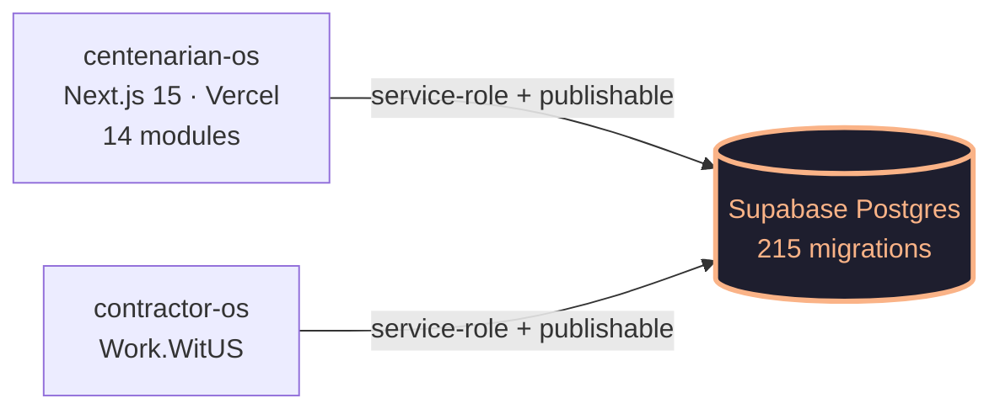

# CentenarianOS

> **One job: the longevity correlation engine over your personal data.** Health, habits, focus,
> nutrition and personal finance are co-located in one datastore so the synthesis surfaces
> ([`/dashboard/correlations`](./app/dashboard/correlations), [`/dashboard/retrospective`](./app/dashboard/retrospective),
> [`/dashboard/weekly-review`](./app/dashboard/weekly-review)) can surface cross-domain patterns no
> single-vertical tracker can see. That co-location is the product, not an accident of scope.

> **Solo-built personal OS.** 14 modules in one Next.js 15 monolith, **Supabase Postgres shared with a sibling product** ([Work.WitUS](https://work.witus.online)), offline-first via service-worker + IndexedDB queue, **215 migrations** to date.

**Actively decomposing.** Modules that a sibling WitUS app already owns are being removed under
the ecosystem's "one app, one job" rule (see [CLAUDE.md](./CLAUDE.md)) — Media → Stream.WitUS,
Academy → Learn.WitUS, contractor residue → Work.WitUS, Travel → RideWitUS. The correlation core
stays integrated on purpose. The staged plan and the ecosystem registry live in the untracked
`plans/` working area (`plans/49-decomposition-staged-plan.md`, `plans/ecosystem/README.md`).

- **Stage 1, Media → [Stream.WitUS](https://stream.witus.online): in progress.** Media is out of
  the nav, Data Hub, Discover, and the features pages; `/features/media` 308-redirects to
  Stream.WitUS (`next.config.mjs`). `/dashboard/media` stays reachable by URL, read-only with no
  add/edit/delete controls, and its banner's primary action is the CSV export
  (`/api/media/export`), the file users import on Stream.WitUS's media page. Every media write route returns `410 Gone`
  ([`lib/media/retired.ts`](./lib/media/retired.ts)). Pages and routes are removed after a grace
  period; the tables stay until a later stage.

Module lists below describe the pre-decomposition surface, minus Media.


```mermaid
flowchart LR
  classDef shared fill:#1e1e2e,stroke:#fab387,color:#fab387,stroke-width:3px
  classDef external fill:#11111b,stroke:#a6adc8,color:#a6adc8

  CentOS[centenarian-os<br/>Next.js 15 · Vercel<br/>14 modules]
  Contractor[contractor-os<br/>Work.WitUS]
  DB[(Supabase Postgres<br/>215 migrations)]:::shared

  CentOS -->|service-role + publishable| DB
  Contractor -->|service-role + publishable| DB
```

For dev-audience readers:

- **[ARCHITECTURE.md](./ARCHITECTURE.md)** — full module map, Mermaid diagrams of the shared-DB boundary, cross-app traffic via the `unified-schedule` edge function, offline-sync layer, repo layout, and stack table.
- **[MIGRATIONS.md](./MIGRATIONS.md)** — 215 migrations grouped by module, the additive-only discipline that makes shared-DB sane, notable patterns (polymorphic `activity_links`, hot-fix pairs, intentional number collisions), and how to reproduce the count.
- **[CLAUDE.md](./CLAUDE.md)** — AI-collaborator instructions doubling as the project conventions doc (style, a11y, the Shared Database rule, branch workflow).
- **[STYLE_GUIDE.md](./STYLE_GUIDE.md)** — git workflow, branch naming, Conventional Commits, PR rules. Every change starts on a new branch off `main`; `main` is never pushed to directly.
- **[docs/CentenarianAcademy/](./docs/CentenarianAcademy/)** — course-authoring standards: `CourseAuthoringGuide.md` (craft), `CourseProductionPlaybook.md` (process), `CitationIntegrityGuide.md` (verify every source, never ship a fake citation), and `CourseCreationWithAI.md` (hand to your AI). Per-course recipes: `CourseAuthoringGuide NASM CPT/CES/CNC.md` and `CourseAuthoringGuide BVC.md` (Better Vice Club: audio-first, four-lens episodes; episode-per-module; rotating quizzes + FlashLearn recall loop + season-wide glossary). Courses cite only verified, peer-reviewed sources and ship a teacher evidence ledger.

What makes the architecture interesting (and the marketing pitch hard):

1. **Shared database, two apps.** Both this repo and contractor-os hit the same Supabase project. Migrations are additive-only across the boundary; some columns + triggers exist purely so one app can react to writes from the other (e.g., `trg_invoice_due_to_task` materializes a planner row from a contractor invoice).
2. **14 product modules.** Planner · Finance · Focus · Health Metrics · Wearables · Workouts · Exercises · Equipment · Travel · Fuel · Recipes · Blog · Academy/LMS · AI Coach. Plus auxiliary cross-cutting systems (Data Hub, Life Categories, Activity Links, Media Library, Smart Scan).
3. **Offline-first with a real sync queue.** [`lib/offline/sync-manager.ts`](./lib/offline/sync-manager.ts) wraps `fetch()` with a URL-keyed IndexedDB cache for GETs and a queued mutation log for POST/PATCH/DELETE that replays on reconnect. 5-state UI indicator. Service worker stale-while-revalidate.
4. **Multi-decade horizon.** The schema breadth is justified by the use case: a personal OS that wants to be useful for 50+ years has to model planning, money, body, learning, attention, and everything that links them, rather than picking one vertical.

## Operating context

Operated by B4C LLC / AwesomeWebStore.com. Built solo by [Brand Anthony McDonald](https://brandanthonymcdonald.com).

```
B4C LLC / AwesomeWebStore.com  ← legal entity
└── WitUS.online               ← parent brand (philosophy + product directory)
    ├── CentenarianOS.com      ← this repo — the longevity correlation engine
    │   └── Academy (LMS)      ← module inside CentenarianOS today; migrating to Learn.WitUS
    ├── Learn.WitUS.Online     ← separate app, live multi-tenant LMS (BVC tenant)
    ├── Stream.WitUS.Online    ← separate app, cross-media tracker
    └── Work.WitUS.Online      ← separate app, contractor operations (shares DB today)
```

The Academy is still a module of CentenarianOS, but it is **no longer the ecosystem's LMS
of record.** `learn.witus.online` is a live, standalone, multi-tenant LMS (repo
`claude/witus-learn`) already serving the BVC tenant. The Academy's courses are slated to
migrate into it; CentenarianOS keeps in-app tutorials and links out. Earlier revisions of
this README claimed "there is no standalone Learn.WitUS app" — that is no longer true.

## Stack

| Layer | Choice | Notes |
|---|---|---|
| Framework | Next.js 15 App Router | Server Components by default, route handlers for the API surface (365 route handlers). |
| Hosting | Vercel | Fluid Compute for Node.js routes. |
| Database | Supabase Postgres | RLS as the security model. **Shared with contractor-os.** |
| Auth | `@supabase/ssr` | Cookie-based; browser + SSR via the same client. New publishable + secret key system. |
| Styling | Tailwind v4 | WCAG 2.1 AA contrast enforced via global CSS overrides ([`app/globals.css`](./app/globals.css)). |
| Type system | TypeScript strict | No `any` escape hatches in app code. |
| Charts | Recharts | Admin dashboards + correlations module. |
| Media | Cloudinary | Audio / video / image / 360° via signed uploads. |
| Payments | Stripe Connect Express | Teacher payouts (LMS) + platform subscriptions. Webhook-driven sync. + CashApp (lifetime only). |
| AI | Google Gemini | Coach (`gemini-2.5-flash`), embeddings (`text-embedding-004` for CYOA navigation), Vision (universal OCR). |
| Email | Resend (via Supabase native integration) | Transactional auth + admin notifications. |
| Bot prevention | Cloudflare Turnstile | Signup gate. |
| Maps | Leaflet + OSRM | Academy lessons + travel route planning. |
| 360° / VR | Photo Sphere Viewer | Lessons + virtual tours with hotspots. |

## Pricing

| Plan | Price | Notes |
|------|-------|-------|
| **Monthly** | $10.60/month | Full access, cancel anytime |
| **Lifetime (Founder's Price)** | $103.29 one-time | First 100 paid users. Includes free shirt. |
| **Lifetime via CashApp** | $100 to $centenarian | Fee-free alternative. Manual verification. |
| **Teacher Plan** | Separate pricing | 10% platform fee on course sales |

No free plan. All users must subscribe to access paid modules.

## Platform Modules

| Module | Description | Access |
|--------|-------------|--------|
| **Planner** | Roadmap, Goals, Milestones, Tasks hierarchy with day/week/month views; one-field task capture into an auto-created Inbox (works offline), searchable goal picker, Inbox filter; Google Calendar sync (read-only, one or more Google accounts; events on the calendars you choose become planner tasks, daily plus Sync now) | Paid |
| **Fuel** | Nutrition tracking with NCV framework, USDA/Open Food Facts APIs, auto inventory | Paid |
| **Engine** | Pomodoro focus sessions, doodle canvas, daily debrief, AI weekly reviews | Paid |
| **Health Metrics** | RHR, steps, sleep, body composition; Garmin/Oura/WHOOP sync; CSV import | Paid |
| **Workouts & Exercises** | Exercise library with categories; workout templates; Nomad Longevity OS | Paid |
| **Financial Dashboard** | Accounts, transactions, budgets, invoices, bank statement import from CSV or PDF (PDFs read in-process, never sent to a third party; Best Buy / Citibank statements parsed with summary, APRs, promotional balances and a reconciliation check; Capital One, Discover and PayPal Credit website activity printouts; other issuers by a generic fallback; CSV layouts verified against Citi, PayPal, Arizona Federal CU, Navy Federal and Best Buy downloads; also from the Statements box on Settings; card and loan statements in card terms, with payments linked as transfers to the account they were paid from and refunds counted as negative spending; one status color scale with icons) with duplicate detection, matching and undo, CSV export, learned vendor categories ("Always categorize this vendor as...?"), transfers between your own accounts (card and loan payments included) tracked as transfers instead of spending and income, a Budgets page with budgets by month, rollover, and suggested budgets from your own history (average or median of the last 3, 6 or 12 months), multi-currency accounts (cash in any currency for travel, a home currency for totals, Exchange money as a transfer with the fee as its own expense, daily rates from Frankfurter/ECB with ExchangeRate-API as fallback, your own rates always win), a Debt payoff page (interest paid per card/loan by month and year, payoff calculator, debt-free plan with avalanche (default, deferred-interest promo deadlines protected) / snowball / promo-first / custom order, card and loan due dates as planner tasks under Inbox › Bills, a Due soon banner and optional email reminders), savings goals as envelopes inside a real account (allocate, move, and split deposits across goals; monthly amount needed; whether each goal fits your monthly surplus; "Save for this" from a planned trip or equipment item), cash on hand (a dashboard card per cash account with balance and last count, "Count my cash" by total or bills and coins that records the difference as one adjustment with history and undo, one-tap "Paid cash" that works offline, Withdraw into cash, and ATM or branch withdrawals on imported bank statements recorded into a cash account instead of as spending) | Paid |
| **Travel & Vehicles** | Fuel logs with OCR, trip tracking, multi-stop routes, maintenance, IRS mileage | Paid |
| **Equipment & Assets** | Asset tracking, valuation history, media gallery, cross-module links | Paid |
| **Correlations & Analytics** | Cross-module data correlations, trend charts, daily/weekly aggregates | Paid |
| **Data Hub** | CSV import/export for 11+ modules with Google Sheets templates | Paid |
| **Life Categories** | Tag activities across all modules with custom life-area categories | Paid |
| **Academy (LMS)** | Create/sell courses; CYOA navigation; rotating spaced-recall quizzes; FlashLearn flashcards (multiple-choice + classic); per-module key terms; maps, docs, audio, video | Free |
| **Blog** | Rich text publishing, likes/saves, public author profiles | Free |
| **Recipes** | Recipe sharing, URL import, cook profiles, JSON-LD scraping | Free |
| **Cross-Module Links** | Bidirectional activity links, saved contacts/locations across all modules | Paid |
| **AI Coach (Gems)** | Custom AI personas with document/flashcard support | Admin |

## Admin Dashboard

- **User management**: subscription filters, invite system with module restrictions
- **Promo campaigns**: create time-limited discounts with Stripe coupon integration
- **CashApp payments**: review queue for manual lifetime payment verification
- **Lifetime counter**: track paid vs gifted lifetime purchases (Founder's Price: first 100)
- **Content moderation**: recipes, blog posts, feedback, system logs
- **Academy settings**: teacher fee (10%), course management, assignment grading
- **Engagement metrics**: feature usage, conversion funnels, SEO, shortlinks
- **AI Education chat**: codebase Q&A with 5 modes (interview, investor, onboarding, demo, general)
- **Demo reset**: "Reset demo data" on the overview wipes and reseeds the tutorial and visitor demo accounts on demand (the same reset also runs nightly at 00:00 UTC via cron)

## Quick Start

### Prerequisites

- Node.js 18+
- npm / yarn / pnpm
- Supabase account ([supabase.com](https://supabase.com))
- Stripe account (for subscription features)

### Installation

```bash
# Clone repo
git clone https://github.com/dapperAuteur/centenarian-os.git
cd centenarian-os

# Install dependencies
npm install

# Setup environment
cp .env.example .env.local
# Edit .env.local with your credentials
```

### Required Environment Variables

```env
NEXT_PUBLIC_SUPABASE_URL=
NEXT_PUBLIC_SUPABASE_ANON_KEY=
SUPABASE_SERVICE_ROLE_KEY=
STRIPE_SECRET_KEY=
STRIPE_WEBHOOK_SECRET=
NEXT_PUBLIC_STRIPE_PUBLISHABLE_KEY=
STRIPE_MONTHLY_PRICE_ID=
STRIPE_LIFETIME_PRICE_ID=
ADMIN_EMAIL=
NEXT_PUBLIC_ADMIN_EMAIL=
NEXT_PUBLIC_TURNSTILE_SITE_KEY=
TURNSTILE_SECRET_KEY=
GEMINI_API_KEY=
NEXT_PUBLIC_CLOUDINARY_CLOUD_NAME=
CLOUDINARY_API_KEY=
CLOUDINARY_API_SECRET=
NEXT_PUBLIC_CLOUDINARY_UPLOAD_PRESET=
```

### Optional: Sign in with WitUS (ecosystem SSO)

```env
WITUS_OIDC_CLIENT_ID=
WITUS_OIDC_CLIENT_SECRET=
```

An OIDC code flow against the shared WitUS identity provider
(`accounts.witus.online`), on top of the normal Supabase session: `app/api/auth/witus/authorize`
-> IdP -> `.../witus/callback`, which finds-or-creates the user by email and mints an ordinary
CentOS session. The same client id also powers two ecosystem behaviours:

- **"Continue as \<name\>"** — the login page asks the IdP, in parallel with rendering the form,
  whether this browser already has a WitUS session, and relabels the button if it does. The answer
  depends on a third-party cookie, so Safari and Firefox return nothing; a failed or blocked check
  is invisible and the ordinary button remains.
- **Global sign-out** — Logout ends the shared IdP session too, so signing out here signs you out of
  every WitUS app in that browser. The local session is always destroyed first.

Without `WITUS_OIDC_CLIENT_ID` both are dark: the button does not render and sign-out is purely
local. Endpoint overrides and the full reasoning are documented in `.env.example` and
`lib/auth/witus-sso.ts`.

### Multi-currency accounts (no setup)

No API key or env var: exchange rates come from Frankfurter (ECB reference rates,
https://frankfurter.dev) and, for currencies it lacks, ExchangeRate-API's open access endpoint
(https://www.exchangerate-api.com, attribution shown wherever fetched rates appear). Both are read
server-side only and cached in `exchange_rates`. Apply `supabase/migrations/210_multi_currency.sql`;
a Vercel cron (`/api/cron/fx-rates`, daily at 17:00 UTC, `CRON_SECRET` Bearer guard) refreshes the
latest rates for every currency in use and fills missing home-currency amounts. Users set their
home currency and their own rates on Settings → Currencies.

### Optional: Google Calendar (one-way sync)

```env
GOOGLE_OAUTH_CLIENT_ID=
GOOGLE_OAUTH_CLIENT_SECRET=
TOKEN_ENCRYPTION_KEY=       # openssl rand -hex 32; encrypts the stored Google tokens
SUPABASE_JWT_SECRET=        # signs the OAuth state (lib/oauth-state.ts); SUPABASE__SUPABASE_JWT_SECRET also works
```

One-way, Google -> CentenarianOS. The only Calendar scope requested is
`https://www.googleapis.com/auth/calendar.readonly` (plus `openid email` to show which account
is connected), so nothing is ever written to Google.

**What ships today (phases 1 and 2, "connect" + "sync"):** Settings -> Calendar Sync
(`/dashboard/settings/calendar`) connects one or more Google accounts (for example personal and
business; one `calendar_connections` row per Google account, matched on Google's account id), lists
each account's calendars with its own on/off checklist, and shows per account: status, last synced
time, the last run's counts (created / updated / archived / flagged) and errors, **Sync now**,
Reconnect and Disconnect (revokes that account's grant at Google, then deletes its saved tokens and
calendar choices; other accounts stay). **Sync all** syncs every account; a Vercel cron
(`/api/cron/calendar-sync`, daily at 06:00 UTC, `CRON_SECRET` Bearer guard) syncs everyone.

Loading the page re-checks each account with Google (a refresh-token exchange, at most once per 5
minutes per account), so an account whose access was removed at
myaccount.google.com/permissions shows "Needs reconnecting" straight away.

What a sync does (`lib/calendar/google-sync.ts`): the first run of a calendar reads 30 days back to
180 days ahead, later runs read only changes (Google sync token; a 410 Gone falls back to the full
window). Each event becomes a planner task under a "Google Calendar: <calendar name>" milestone
(`resolveImportMilestone`, the Inbox when the user has no roadmap); all-day events at 09:00; times in
the event's or calendar's time zone; moved events move their task, cancelled events archive it,
completed tasks stay completed, and a task the user deleted is not recreated. Titles go through the
capture-token parser and the result is stored in `calendar_sync_items.parsed`, but **only tasks are
created for now**: `#expense`, `#trip` and the other tags do not create records yet (phase 4.4).

**Where the tokens live:** `calendar_connections`, encrypted with AES-256-GCM
(`lib/crypto/tokens.ts`) before they are written. The table has Row Level Security on and no
policies, so only the service-role API routes under `app/api/calendar/google/` can read it, and
no response to the browser includes a token column.

**Setup:**

1. Apply `supabase/migrations/204_calendar_sync.sql`, then `205_calendar_multi_account.sql`
   (several accounts per user, validation and last-run columns). Until both are applied, the routes
   answer with a JSON error (`code: "migration_missing"`) and the page says so.
2. In Google Cloud Console: enable the Google Calendar API, configure the OAuth consent screen,
   and create an OAuth client of type "Web application".
3. On that client, add one authorized redirect URI per origin the app is served from:
   `<origin>/api/calendar/google/callback` (for local development,
   `http://localhost:3000/api/calendar/google/callback`). The app builds the URI from the origin
   of the request, and Google requires an exact match (scheme, host, case, no trailing slash).
4. Set the four variables above. With any of them missing, the settings page shows "not
   available on this site yet" instead of a Connect button.

**Good to know (from Google's OAuth documentation):** while the consent screen's publishing
status is "Testing", Google issues refresh tokens that expire after 7 days for scopes beyond
name, email and profile
([Refresh token expiration](https://developers.google.com/identity/protocols/oauth2#expiration)).
In that state the page asks the user to Reconnect about once a week. Google describes that
7-day limit only for the "Testing" status.

**Verification status:** connect and disconnect (phase 1) were checked by hand against the live
OAuth client on 2026-10-04. The sync engine, several accounts, and the on-load revocation check
were written from Google's documentation and are covered by unit tests with fakes only. Check by
hand after applying migration 205: a second Google account connects next to the first; Sync now
creates tasks under "Google Calendar: <name>"; a second Sync now changes nothing; moving an event
in Google and syncing moves the task; deleting it archives the task; removing access at
myaccount.google.com/permissions shows "Needs reconnecting" on the next page load (allow up to 5
minutes since the last check); and the daily cron run appears as a new "Last synced" time.

### Optional: Error Monitoring (Better Stack)

Crash reporting runs through the Sentry SDK, pointed at Better Stack (which speaks
the Sentry protocol). Every variable below is **optional**: with none of them set
the SDK never initializes and the app behaves exactly as it did before.

```env
SENTRY_DSN=                 # server + edge runtimes
NEXT_PUBLIC_SENTRY_DSN=     # browser runtime
SENTRY_ORG=                 # source-map upload only
SENTRY_PROJECT=
SENTRY_AUTH_TOKEN=          # omit and the build skips source maps entirely
```

Setting `SENTRY_AUTH_TOKEN` is what turns source maps on. Without it the build
neither generates nor uploads them, so production stack traces stay minified.
That is a deliberate trade: generating maps that cannot be uploaded is expensive
enough to have contributed to an out-of-memory Vercel build.

Because this app holds health data, reports are scrubbed before they leave the
process: `lib/sentry-scrub.ts` drops the user object, cookies, auth headers, the
request body, and every query string, and masks token-shaped URL segments.
Tracing and Session Replay are both hard-coded to `0`.

### Uptime Monitoring: point monitors at `/api/health`

**Point every uptime monitor at `https://<your-domain>/api/health`, not at the
homepage.** The homepage can serve a cached `200` while Supabase is down, so a
green check there proves nothing. `/api/health` is never cached
(`force-dynamic` plus `Cache-Control: no-store`) and always makes a live round
trip to the database before it answers.

| Condition | Status | Body |
|---|---|---|
| Database answered | `200` | `{"ok":true,"service":"centenarian-os","checks":{"database":"ok"},"latencyMs":42,"checkedAt":"..."}` |
| Database errored, timed out (4s), or is not configured | `503` | `{"ok":false,"service":"centenarian-os","error":"database_unreachable","checks":{"database":"fail"},"latencyMs":4001,"checkedAt":"..."}` |

The `error` field is one of two fixed tokens, `database_unreachable` or
`not_configured`. Configure the monitor to alert on any non-`200`, or to expect
the string `"ok":true` in the body.

Design notes, because this app holds health data:

- The route is public and unauthenticated but leaks nothing. The raw database
  error is **never** echoed (it can carry host names and credential context),
  only the fixed reason token is returned.
- It runs on the **anon/publishable key**, never `SUPABASE_SERVICE_ROLE_KEY`. A
  public endpoint must not hold elevated credentials.
- It returns, counts, and hints at **no user data**. The probe is a `HEAD`
  request against `metric_config` (a seeded configuration table of metric labels
  and unlock rules, with no user rows), so PostgREST returns no body and no
  count, and RLS denies the anon role anyway. The only assertion is "Postgres
  answered".
- The check aborts after 4 seconds, so a hung database returns `503` fast
  instead of holding the monitor open.

Source: [`app/api/health/route.ts`](./app/api/health/route.ts).

### Database Setup

```bash
# Option A: Supabase CLI
supabase db push

# Option B: SQL Editor in Supabase Dashboard
# Run migrations in order from supabase/migrations/
```

There are 215 migrations (see [`MIGRATIONS.md`](./MIGRATIONS.md) for the gallery). Run them in numeric order. The database is shared with the ContractorOS (Work.WitUS) app — read [`CLAUDE.md`](./CLAUDE.md) §"Shared Database" before adding any.

### Run Development Server

```bash
npm run dev
```

Open [http://localhost:3000](http://localhost:3000)

### Run Unit Tests

```bash
npm run test:unit
```

Runs the pure-function tests with Node's built-in test runner (`node --test --experimental-strip-types`, Node 22.6+). No database, network or extra dependencies. Covers merchant-name matching and learned vendor categories (`tests/transaction-matching.test.ts`), the stored-secret encryption helper (`tests/unit/crypto-tokens.test.ts`), the Google Calendar client and token refresh (`tests/unit/google-calendar-client.test.ts`, with a fake `fetch`), and the Google Calendar sync helpers: event to task fields, time zones, the sync decision and the 410 fallback (`tests/unit/google-sync.test.ts`).

## Project Structure

```
centenarian-os/
├── app/                        # Next.js App Router
│   ├── api/                   # API route handlers
│   │   ├── cashapp/           # CashApp payment submission
│   │   ├── exercises/         # Exercise library CRUD
│   │   ├── finance/           # Finance APIs
│   │   ├── fuel/              # Nutrition APIs
│   │   ├── health/            # Public uptime probe (checks Supabase)
│   │   ├── health-metrics/    # Metrics APIs
│   │   ├── planner/           # Planner APIs
│   │   ├── pricing/           # Public pricing data (founders, promos)
│   │   ├── stripe/            # Checkout, webhooks, sync, portal
│   │   ├── travel/            # Travel & vehicle APIs
│   │   ├── workouts/          # Workout logging APIs
│   │   └── ...                # 20+ more endpoint groups
│   ├── admin/                 # Admin dashboard (20+ pages)
│   ├── dashboard/             # Protected dashboard pages (15+ modules)
│   ├── academy/               # LMS (courses, lessons, DMs, paths)
│   ├── blog/                  # Community blog
│   ├── recipes/               # Recipe sharing
│   └── pricing/               # Public pricing page
├── components/                # React components
│   ├── admin/                 # AdminSidebar, admin UI
│   ├── exercises/             # Exercise library UI
│   ├── finance/               # Finance UI
│   ├── focus/                 # DoodleCanvas, timer, templates
│   ├── nav/                   # Navigation (DesktopNav, MobileDrawer, NavConfig)
│   ├── workouts/              # Workout UI
│   └── ui/                    # Shared UI (Modal, HelpDrawer, DataImporter, etc.)
├── lib/
│   ├── hooks/                 # useAuth, useSubscription, useClockFormat, etc.
│   ├── contexts/              # SyncContext (offline)
│   ├── stripe/                # Stripe client singleton
│   ├── shopify/               # Promo code generation
│   └── supabase/              # Server & client Supabase clients
├── content/tutorials/         # 15+ tutorial course scripts
├── public/templates/          # CSV import templates (10+ modules)
└── supabase/
    └── migrations/            # 215 database migrations — see MIGRATIONS.md
```

For the full module map and the cross-app shared-DB story, see **[ARCHITECTURE.md](./ARCHITECTURE.md)**.

## Security

- **Authentication**: Supabase Auth + Cloudflare Turnstile on signup
- **Authorization**: Row Level Security (RLS) on all tables
- **Profiles**: billing, plan and role columns (`subscription_status`, `stripe_*`, `role`, `invite_limit`, `products`, `selected_modules`, ...) can only be changed by server code with the service role; a trigger rejects browser-session writes (migration 206). Other users' names, avatars and bios are read from the `public_profiles` view, and the `profiles` table is readable only by its owner (migration 207). See `lib/profiles/public-profiles.ts`.
- **Data Encryption**: TLS 1.3 in transit, AES-256 at rest
- **Subscription gating**: Server-side and client-side access control
- **Admin guard**: ADMIN_EMAIL env var check on all admin routes

Report vulnerabilities: [security@awews.com](mailto:security@awews.com)

## Roadmap

See the live [Tech Roadmap](https://centenarianos.com/tech-roadmap) for the full feature timeline.

**Shipped phases:**
- [x] Phase 1: Core infrastructure, auth, subscriptions, admin
- [x] Phase 2: Nutrition & Recipes (Fuel module)
- [x] Phase 3: Publishing Platform (Blog & Community)
- [x] Phase 4: Centenarian Academy (LMS) — 100+ features
- [x] Phase 5: Travel & Vehicle Tracking
- [x] Phase 7: Demo Accounts & Onboarding
- [x] Phase 10: Financial Dashboard
- [x] Phase 11: Equipment & Asset Tracking
- [x] Phase 12: Cross-Module Connections
- [x] Phase 14: CashApp Payments & Promo Campaigns

**In progress:**
- [ ] Phase 6: Focus Engine & AI Insights — correlation analysis remaining
- [ ] Phase 9: Biometrics & Recovery — HRV, sleep deep-dive
- [ ] Phase 13: User Experience & Personalization

**Planned:**
- [ ] Phase 8: Link Tracking & Marketing Analytics (Switchy.io)
- [ ] Phase 15: Periodic Reviews (Month/Quarter/Year in Review)

## Contributing

See [CONTRIBUTING.md](./CONTRIBUTING.md) for development workflow and coding standards.

## License

Proprietary B4C LLC / AwesomeWebStore.com

## Acknowledgments

Built with [Next.js](https://nextjs.org/), [Supabase](https://supabase.com/), [Tailwind CSS](https://tailwindcss.com/), [Stripe](https://stripe.com/), [Google Gemini](https://ai.google.dev/), [Cloudinary](https://cloudinary.com/), [Excalidraw](https://excalidraw.com/)

---

**Status**: Active Development | **Version**: 0.5.0
